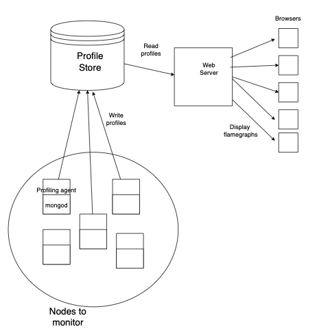

# MongoDB Continuous Profiler

A project that continuously collects profiles across a MongoDB cluster (or multiple clusters) and

displays them as flamegraphs.

## Architecture

## Running

### The agent

Needs to be started on each node that user wants to monitor (currently only supports monitoring mongod process).

Set kernel.perf_event_paranoid = -1.  Might need to run with sudo.  Need to install perf.

cd profiler

ATLAS_URI="..." python3 profile-server.py

### The web server

cd api

ATLAS_URI="..." node app.js

### Start front end

cd client

npm start

Go to localhost:3000

## Future work

* Ability to toggle profiling (at different granularities)
* Search bar for timestamps

